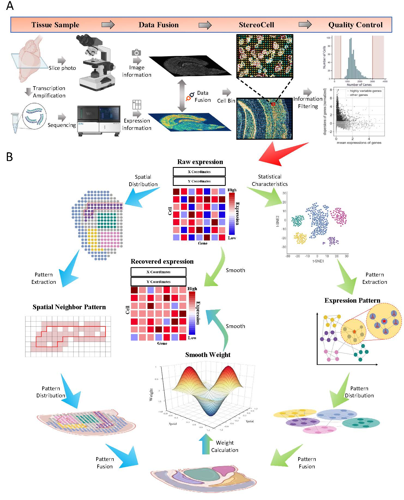

[](https://pepy.tech/project/EAGS)


# EAGS: efficient and adaptive Gaussian smoothing applied to high-resolved spatial transcriptomics
## Introduction
EAGS is a smoothing approach for spatial transcriptome data with ultrahigh resolution. 
Through the principal component information of the profiling of gene expression and the 
personally identifiable information between cells, it uses a two-factor adaptive smoothing 
weight mechanism to determine the neighborhood relationship of cells. Then it uses the 
self-developed smoothing weight formula to calculate the smoothing contribution and 
recalculate the gene expression of each cell.

This work belongs to the thematic series of Spatio-temporal omics algorithms.
## Schematic Diagram


Figure: A. The spatio-temporal omics data processing flow. B. The EAGS method flow.


## Quick Start

### Download the GitHub Repository
[Download](https://github.com/STOmics/EAGS/archive/refs/heads/main.zip) this GitHub repository, and extract the contents into a folder.

### Data Description
We provide a demo data `data/demo.h5ad` that generated by ScDesign3. The high-resolved transcriptomics data that we used
can be downloaded from Zenodo (Mouse Olfactory Bulb: olfactory_bulb_correction_gmm.h5ad, Mouse Brain: SS200000141TL_B5_rawdata.h5ad, https://zenodo.org/record/7906815).

## Option 1:Install and use it by Git
### Install Dependencies
```bash
### Python enviroment constructed by Conda
conda create -n EAGS python=3.8
conda activate EAGS
pip install -r requirements.txt
```

### Running EAGS Script from the Command-line

```bash
cd ./EAGS-main

# EAGS
python EAGS.py
--input data/demo.h5ad
--output data/demo_EAGS_smoothing.h5ad
--smooth_threshold 90
--a 1
--b 0
--n_comps 50
--n_neighbors 10
--normalize_zscore False
```

EAGS can also be performed directly without some parameter setting as:
```bash
# EAGS
cd ./EAGS-main

python EAGS.py
--input data/demo.h5ad
--output data/demo_EAGS_smoothing.h5ad
```

## Option 2:Install and use it by Pypi
```bash
# Conda Terminal
pip install EAGS

# python Console
from EAGS import *
import scanpy as sc
adata = sc.read_h5ad('data/demo.h5ad')
result = gaussian_smooth_adaptively(adata = adata)
```


### Parameter Explanation

The core function of the EAGS method is the `gaussian_smooth_adaptively` function provided in `EAGS.py`, and the 
detailed formula of this function has been given in the `EAGS_function.py`.

The following func is a quick example of running our Smoothing strategy. The function `gaussian_smooth_adaptively()` takes 
in `anndata (H5AD format)` 
object with the cell information (such as gene MID Counts in `anndata.X` , spatial coordinates in `anndata.obsm['Spatial']`). 
For more details on the input anndata (H5AD format), please check on [link](https://anndata.readthedocs.io/en/latest/).

    adata_after_smooth = gaussian_smooth_adaptively(adata=adata,
                                                    smooth_threshold=90,
                                                    a=1,
                                                    b=0,
                                                    n_comps=50,
                                                    n_neighbors=10,
                                                    normalize_zscore=True)

The parameters of  `gaussian_smooth_adaptively` are:
- `adata`: The adata file (H5AD format) that need to be smoothed.
- `smooth_threshold`: Controling the gradient of Gaussian curve.
- `a`: The a-value of the Gaussian kernel function, which is used to control the height of the Gaussian curve.
- `b`: The b-value of the Gaussian kernel function, which is used to control the centre of the Gaussian curve.
- `n_comps`: Number of principal components for calculating neighborhoods. 
- `n_neighbors`: Number of nearest neighbors for computing kernel bandwidth.
- `normalize_zscore`: Default preprocessing method for raw counts matrix, where "True" means the input anndata.X data that need to be normalized first and "False" means the input anndata.X data 
that have been normalized.

The output of `gaussian_smooth_adaptively()` is a `anndata(H5AD format)` includes:
- `adata.X`: MID counts that have been smoothed.
- `adata.obsm[spatial]`: Spot's spatial coordinates.

## Tutorial
The analytical scripts used in this study and the corresponding results, various types of analysis and comparison 
methods are organized as Notebook (Turtorial/Turtorial_of_EAGS.ipynb).

## Citation
If you use `EAGS` in your work, please cite it.
> **EAGS: efficient and adaptive Gaussian smoothing applied to high-resolved spatial transcriptomics**
>
> Tongxuan Lv, Ying Zhang, Mei Li, Qiang Kang, Shuangsang Fang, Yong Zhang, Susanne Brix, Xun Xu
> 
> _GigaScience_ 2024 Feb 20. doi: [10.1093/gigascience/giad097](https://doi.org/10.1093/gigascience/giad097).


## Contact
Any questions or suggestions on EAGS are welcomed! Please report it on issues, 
or contact Tongxuan Lv (lvtongxuan@genomics.cn) or Ying Zhang (zhangying7@genomics.cn).
We recommend using [STOmics Cloud Platform](https://cloud.stomics.tech/) to access and use it.
